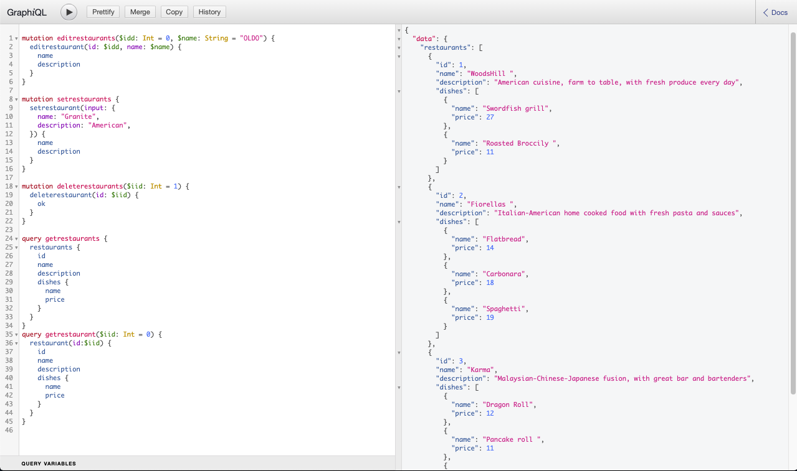

<div align="center" id="top">
     
</div>

# <h1 align="center">GraphQL - Queries</h1>

<p align="center">
  <a href="#dart-description">Description</a> &#xa0; | &#xa0; 
  <a href="#dart-demo">Demo</a> &#xa0; | &#xa0;
  <a href="#memo-improvements">Improvements</a> &#xa0; | &#xa0;
  <a href="#art-technologies">Technologies</a> &#xa0; | &#xa0;
  <a href="#white_check_mark-requirements">Requirements</a> &#xa0; | &#xa0;
  <a href="#toolbox-installation">Installation</a> &#xa0; | &#xa0;
  <a href="#joystickhow-to-play">How to Play</a> &#xa0; | &#xa0;
  <a href="#briefcase-license">License</a> &#xa0; | &#xa0;
  <a href="https://github.com/arturomsoberanes" target="_blank">Author</a>
</p>

<br>


## :notebook_with_decorative_cover:	 Description ##

Queries to Create, Read, Update and Delete data with GraphQL

## :pencil2: Improvements ##

These are the list of currect improvements:

- :pushpin:	Add more query types.	

## :building_construction: Technologies ##

- [JavaScript](https://www.w3schools.com/js/)
- [Node.js](https://nodejs.org/)
- [GraphQL](https://graphql.org/)
- [Express](https://expressjs.com/)

## :spiral_notepad: Requirements ##

Before starting :checkered_flag:, you need to have:
- [Git](https://git-scm.com).
- [Node.js](https://nodejs.org/en/).

## :toolbox: Installation ##

Clone Repository

```bash
$ git clone https://github.com/eduardo-ortiz09/graphql-queries.git
```
Go to directory

```bash
$ cd graphql-queries
```
Install the dependencies

```bash
$ npm install 
```

## :joystick:	How to Run ##

Run the command "npm start"

```bash
$ npm start
```


## :briefcase:	 License ##

This project is under license from MIT. For more details, see the [LICENSE](LICENSE) file.


Made with :heart: by <a href="https://github.com/eduardo-ortiz09/" target="_blank">Eduardo Ortiz</a>

&#xa0;

<a href="#top">Back to top</a>


